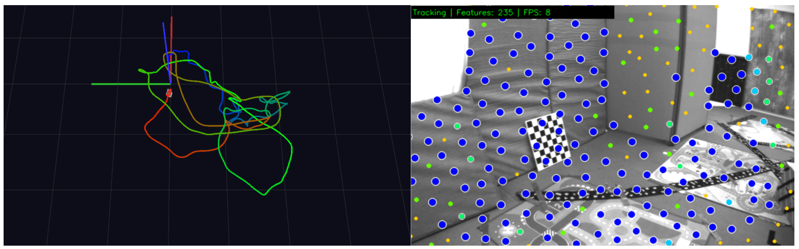
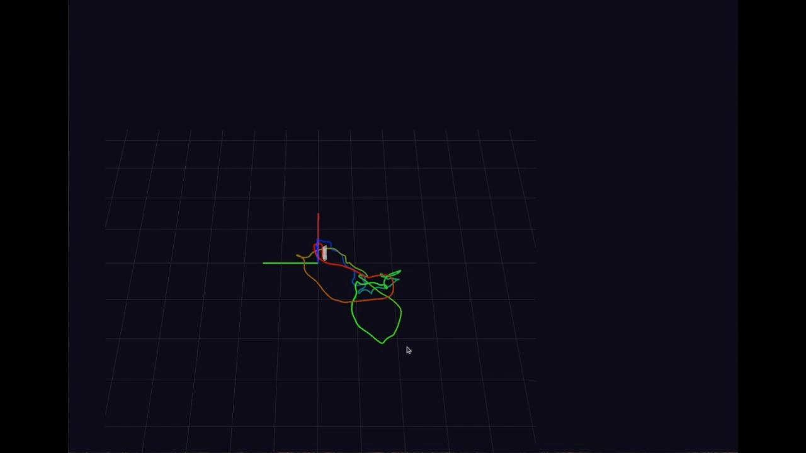

<!--
 * @Author: Hongkun Luo
 * @Description: MiniVIO — A Minimal, Robust and Easy-to-Learn Visual-Inertial Odometry
 *
 * Hongkun Luo
-->

<h2 align="center">MiniVIO: A Minimal, Robust and Easy-to-Learn<br>Visual-Inertial Odometry</h2>

<h3 align="center">
  <a href="https://luohongkun.top/scholar/">Hongkun Luo</a>
</h3>

<p align="center">
    <a href="https://github.com/HKUST-Aerial-Robotics/VINS-Mono">
        
    </a>
    <a href="https://github.com/HeYijia/VINS-Course">
        
    </a>
    <a href="https://cmake.org/">
        
    </a>
    <a href="https://www.docker.com/">
        
    </a>
    <a href="https://google.github.io/styleguide/cppguide.html">
        
    </a>
    <a href="https://www.gnu.org/licenses/gpl-3.0.html">
        
    </a>
</p>

<div align=center></div>

---

## 🎬 Demo

<div align=center></div>

<div align=center></div>

---

## 🔍 项目简介 (Overview)

**MiniVIO** 是一个面向**学习与研究**的最小化、可单步调试的视觉惯性里程计 (VIO) 系统。它基于贺一家老师的 [VINS-Course](https://github.com/HeYijia/VINS-Course)，在保持无 ROS 依赖的轻量结构基础上，做了**鲁棒性修复**、**工程化重构**与**Docker 化部署**。

### 💡 为什么开源 MiniVIO？

| 痛点                                       | MiniVIO 的解决方式                                                      |
| ------------------------------------------ | ----------------------------------------------------------------------- |
| VINS-Mono / VINS-Fusion 体量大、强依赖 ROS | **去 ROS 化**，纯 C++ 实现，方便单步调试与算法学习                |
| VINS-Course 后端在异常数据下容易崩溃       | 修复**坏特征点 / 负逆深度 / NaN-Inf / 病态矩阵** 等致命鲁棒性问题 |
| 编译环境配置繁琐                           | 提供**一键 Docker** 镜像，10 分钟内即可启动                       |
| 代码风格不统一、阅读门槛高                 | 按**Google C++ Style** 重构代码结构，命名清晰、模块解耦           |

### 🛡️ 鲁棒性修复（核心改进）

彻底解决了 VINS 后端优化在以下场景下的致命问题：

- ✅ 坏特征点 / 负逆深度 导致的崩溃与卡死
- ✅ NaN / Inf 数值导致的位姿停更
- ✅ 病态矩阵导致的先验永久污染
- ✅ LM 求解器发散失控

> 💬 MiniVIO 是一个非常清量、非常容易懂的 VIO 入门项目，适合所有想深入理解 VIO 内部机制的同学。

---

## 🐳 快速开始 (Docker, 推荐)

### 📋 环境要求

- Docker
- X11 服务器（用于 Pangolin 可视化）

### 🏗️ 1. 构建 Docker 镜像

构建大概需要 **10 分钟**：

```bash
git clone https://github.com/luohongk/MiniVIO
cd MiniVIO
docker build -f docker/Dockerfile -t minivio:latest .
```

### 🚀 2. 启动容器

```bash
xhost +local:root && \
docker run -it \
  --gpus all \
  --network=host \
  --privileged \
  -v /tmp/.X11-unix:/tmp/.X11-unix \
  -e DISPLAY=$DISPLAY \
  -e HOME=/root \
  -v <YOUR_MINIVIO_PATH>:/root/workspace/MiniVIO \
  -v <YOUR_DATA_PATH>:/root/data \
  --name MiniVIO_work \
  -w /root/workspace/MiniVIO \
  minivio:latest
```

> 将 `<YOUR_MINIVIO_PATH>` 替换为你本地 MiniVIO 仓库路径，`<YOUR_DATA_PATH>` 替换为数据集目录。

例如：

```bash
xhost +local:root && \
docker run -it \
  --gpus all \
  --network=host \
  --privileged \
  -v /tmp/.X11-unix:/tmp/.X11-unix \
  -e DISPLAY=$DISPLAY \
  -e HOME=/root \
  -v /home/lhk/workspace/MiniVIO/:/root/workspace/MiniVIO \
  -v /home/lhk/data:/root/data \
  --name MiniVIO_work \
  -w /root/workspace/MiniVIO \
  minivio:latest
```

### 🔨 3. 容器内编译

```bash
cd ~/workspace/MiniVIO
mkdir -p build && cd build

# 发布模式（默认推荐）
cmake .. -DCMAKE_BUILD_TYPE=Release

# 调试模式（用于单步调试）
# cmake .. -DCMAKE_BUILD_TYPE=Debug

make -j8
```

### ▶️ 4. 运行

数据下载：[https://github.com/luohongk/MiniVIO/releases/download/example/V1_01_easy.zip]()

修改 `config/euroc_config.yaml`，把数据集路径改成你自己的：

```yaml
# common parameters
imu_topic:    "/imu0"
image_topic:  "/cam0/image_raw"
output_path:  "/home/lhk/output"

# dataset parameters
imu_data_file:   "V101_imu0.txt"   # IMU data file (relative to config path)
image_data_file: "V101_cam0.txt"   # image timestamp file (relative to config path)
image_subdir:    "cam0/data/"      # image subdirectory (relative to data path)
```

启动：

```bash
cd build/bin
./run_euroc ~/data/slam_data/V2_02_medium/mav0/ ../../config/
```

> `~/data/slam_data/V2_02_medium/mav0/` 替换为你自己的 EuRoC 数据集路径。

完整运行视频：[image/5月29日.mp4](image/5月29日.mp4)

---

## 🔧 本地编译 (非 Docker)

### 📋 依赖列表

| 依赖                   | 版本           | 说明                                                                      |
| ---------------------- | -------------- | ------------------------------------------------------------------------- |
| **Ubuntu**       | 20.04 (64-bit) | 18.04 / 22.04 也可用，OpenCV 需自行编译                                   |
| **Pangolin**     | 0.6            | [GitHub](https://github.com/stevenlovegrove/Pangolin)                        |
| **OpenCV**       | 4.2.0          | Ubuntu 20.04 可直接 `apt install`                                       |
| **Eigen**        | -              | `sudo apt install libeigen3-dev`                                        |
| **Ceres Solver** | 2.1.0          | 用于初始化阶段的 SfM；[GitHub](https://github.com/ceres-solver/ceres-solver) |

### 🛠️ 1. 安装依赖

**Pangolin 0.6：**

```bash
git clone --depth 1 --branch v0.6 https://github.com/stevenlovegrove/Pangolin.git
cd Pangolin && mkdir build && cd build
cmake .. -DCMAKE_BUILD_TYPE=Release -DBUILD_EXAMPLES=OFF -DBUILD_TESTS=OFF
make -j4 && sudo make install
```

**OpenCV 4.2.0（Ubuntu 20.04）：**

```bash
sudo apt-get install libopencv-dev
```

> Ubuntu 18.04 / 22.04 用户请到 [OpenCV 官方仓库](https://github.com/opencv/opencv) 自行编译。

**Eigen：**

```bash
sudo apt-get install libeigen3-dev
```

**Ceres 2.1.0：**

```bash
git clone --depth 1 --branch 2.1.0 https://github.com/ceres-solver/ceres-solver.git
cd ceres-solver && mkdir build && cd build
cmake .. -DBUILD_TESTING=OFF -DBUILD_EXAMPLES=OFF -DCMAKE_CXX_STANDARD=14
make -j4 && sudo make install
```

### 🏗️ 2. 编译 MiniVIO

```bash
git clone https://github.com/luohongk/MiniVIO
cd MiniVIO
mkdir -p build && cd build

# 发布模式
cmake .. -DCMAKE_BUILD_TYPE=Release

# 调试模式（可选）
# cmake .. -DCMAKE_BUILD_TYPE=Debug

make -j8
```

---

## ▶️ 运行示例

### 1️⃣ Curve Fitting — 验证 Solver 正确性

```bash
cd build/bin
./curve_fitting
```

### 2️⃣ EuRoC 数据集上的 MiniVIO

```bash
cd build/bin
./run_euroc ~/data/cuvslam_data/V2_02_medium/mav0/ ../../config/
```

---

## 📊 精度评估

使用 [EVO](https://github.com/MichaelGrupp/evo) 工具与 EuRoC 真值进行对比：

```bash
evo_ape euroc euroc_mh05_groundtruth.csv pose_output.txt -a -p
```

---

## 📄 License

MiniVIO 基于 [GNU General Public License v3.0](https://www.gnu.org/licenses/gpl-3.0.html) 发布。

代码可靠性仍在持续完善中。如有技术问题，欢迎联系：

项目交流联系：罗宏昆 (Hongkun Luo) `luohongkun0715@gmail.com`

---

## 🙏 致谢 (Acknowledgements)

MiniVIO 站在以下优秀开源项目的肩膀上：

- [VINS-Mono](https://github.com/HKUST-Aerial-Robotics/VINS-Mono) — 港科大沈劭劼老师组的视觉惯性 SLAM 经典工作
- [VINS-Course](https://github.com/HeYijia/VINS-Course) — 贺一家老师的去 ROS 化教学版本，本项目的直接基础
- [Ceres Solver](http://ceres-solver.org/) — 非线性优化库
- [Pangolin](https://github.com/stevenlovegrove/Pangolin) — 可视化库

特别感谢以上作者的开源贡献，让 SLAM 学习更加平易近人。
